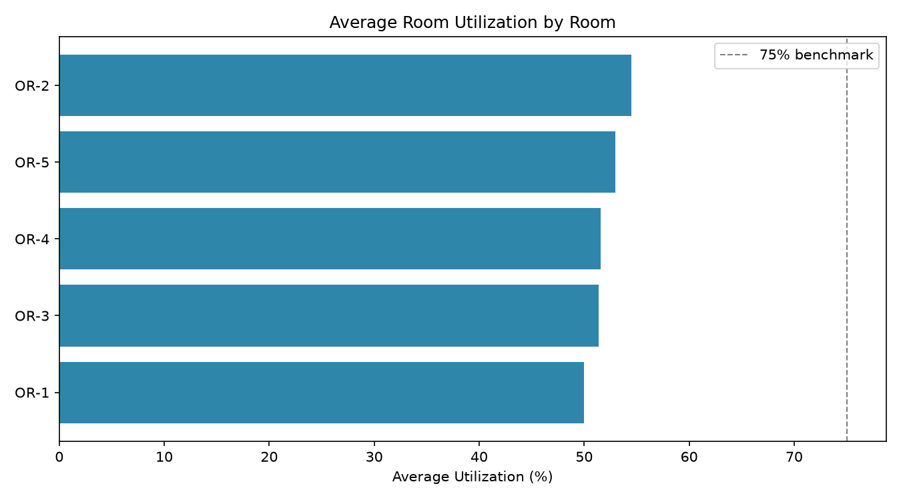

# OR / Procedure Room Utilization Tool

[](https://github.com/anikethperuri7/or-utilization-tool/actions/workflows/ci.yml)
[](https://www.python.org/)
[](LICENSE)

A data analysis toolkit that turns operating room / procedure room scheduling
data into actionable operational metrics — **utilization, turnaround time,
start delays, overruns, and cancellations** — and simulates process
improvements to estimate how many additional procedures could realistically
fit into existing block time, **without adding operating hours**.

> **Why this project:** I built this after seeing firsthand, working in a
> hospital surgery department (Northside), how much OR capacity quietly
> disappears to late starts, slow room turnovers, and last-minute
> cancellations — and how hard it is to make that visible without digging
> through raw scheduling exports by hand. This tool automates that
> analysis end-to-end, from raw CSV to charts to a "what-if" simulator that
> translates process-improvement ideas into an estimated number of
> additional cases.

All data in this repository (`data/sample_schedule.csv`) is **fully
synthetic** — generated by `scripts/generate_sample_data.py` to have
realistic statistical properties (cancellation rates, turnaround
distributions, cascading delays across a day) without containing any real
patient, surgeon, or hospital information.

---

## What it does

|Metric|Description|
|-|-|
|**Room utilization %**|Occupied time vs. available block time, per room-day|
|**Turnaround time**|Gap between one case ending and the next case starting, per room|
|**Start delay**|Actual start vs. scheduled start, including cascading delay across the day|
|**Overrun**|Actual end vs. scheduled end (cases running long)|
|**Cancellation rate**|Cancelled cases as a % of scheduled cases, overall and by surgeon|
|**Idle time**|Block time never consumed by any case|

On top of the metrics, the **simulation engine** models three realistic
process-improvement levers — faster turnarounds, reduced start delay, and
reduced overruns — and estimates the reclaimed minutes and additional
case-equivalents per room-day, alongside a transparent list of every
assumption used (see [`simulate.py`](src/or_utilization/simulate.py) for the
full methodology notes).

## Example output

Running `or-util analyze` on the bundled 60-weekday, 5-room sample dataset
produces a Markdown report with charts like this:


```
Room-days analyzed:        300
Cases scheduled:           1249  (1175 completed, 74 cancelled)
Cancellation rate:         5.9%
Overall room utilization:  52.1%
Average start delay:       5.2 min
Average overrun:           11.3 min
Average turnaround time:   29.7 min
```

Running `or-util simulate` with a moderate improvement scenario (10-minute
faster turnarounds, 30% less start delay, 25% less overrun) on the same
data estimates:

```
Total minutes reclaimed:                    12,546 min
Additional cases (efficiency gains alone):  157.2
Baseline avg utilization:                   52.1%
Projected avg utilization:                  59.0%
```

## Installation

```bash
git clone https://github.com/anikethperuri7/or-utilization-tool.git
cd or-utilization-tool
pip install -e ".[dev]"
```

Or with plain requirements files:

```bash
pip install -r requirements.txt        # runtime only
pip install -r requirements-dev.txt    # + testing/linting/notebooks
```

## Quickstart

```bash
# 1. Generate a synthetic sample schedule (or bring your own CSV — see schema below)
python scripts/generate_sample_data.py --out data/sample_schedule.csv --days 60 --rooms 5

# 2. Compute metrics and generate a Markdown report + charts
or-util analyze --input data/sample_schedule.csv --output-dir reports/latest

# 3. Simulate a process-improvement scenario
or-util simulate --input data/sample_schedule.csv --output-dir reports/latest \
    --turnaround-reduction 10 \
    --start-delay-reduction-pct 30 \
    --overrun-reduction-pct 25
```

Both commands accept `--json-summary` to print the headline numbers as JSON
for piping into another tool or dashboard.

Or use it as a library:

```python
from or_utilization import load_schedule, compute_metrics, simulate_schedule_optimization

df = load_schedule("data/sample_schedule.csv")
metrics = compute_metrics(df)

print(metrics.overall)
print(metrics.daily_room_summary.head())

sim = simulate_schedule_optimization(
    metrics.daily_room_summary,
    turnaround_reduction_min=10,
    start_delay_reduction_pct=30,
    overrun_reduction_pct=25,
)
print(sim.summary)
```

See [`notebooks/exploratory_analysis.ipynb`](notebooks/exploratory_analysis.ipynb)
for a full walkthrough with visualizations.

## Bring your own data

The loader expects a CSV with these columns (case-insensitive):

|Column|Required|Description|
|-|-|-|
|`room_id`|✅|Room/OR identifier, e.g. `OR-1`|
|`date`|✅|Schedule date|
|`scheduled_start` / `scheduled_end`|✅|Planned times (`HH:MM`)|
|`procedure_type`|✅|Procedure name|
|`actual_start` / `actual_end`|optional|Actual times; blank if cancelled|
|`surgeon_id`|optional|Surgeon identifier|
|`status`|optional|`completed` / `cancelled`; inferred from actual times if omitted|
|`block_start` / `block_end`|optional|Surgeon block window; defaults to the scheduled slot if omitted|

The loader validates required columns, infers sensible defaults for
everything else, and prints a note for every inference it makes — nothing
happens silently. See [`loader.py`](src/or_utilization/loader.py) for full
details.

## Project structure

```
or-utilization-tool/
├── src/or_utilization/
│   ├── loader.py        # CSV → validated, cleaned DataFrame
│   ├── metrics.py       # Utilization, delay, overrun, turnaround, cancellation metrics
│   ├── simulate.py      # "What-if" schedule-optimization simulator
│   ├── report.py        # Markdown + chart report generator
│   └── cli.py           # `or-util` command-line interface
├── scripts/
│   └── generate_sample_data.py   # Synthetic sample data generator
├── tests/                       # pytest suite (loader, metrics, simulation)
├── notebooks/
│   └── exploratory_analysis.ipynb
├── data/
│   └── sample_schedule.csv      # Synthetic sample dataset
└── reports/latest/              # Generated report + charts (gitignored except this example)
```

## Methodology notes / limitations

* This is a **transparent, assumption-driven heuristic model**, not a
discrete-event or queueing simulation. Every number in a simulation output
traces back to a stated input assumption (see the `assumptions` dict on
every `SimulationResult`), by design — the goal is to support a concrete,
challengeable conversation with OR leadership about where time is going,
not to produce a black-box forecast.
* Turnaround time is computed only between **consecutive completed cases in
the same room on the same day**; it does not model parallel/concurrent
turnover workflows.
* The simulator treats reclaimed minutes as convertible to whole
case-equivalents via an average case length; it does not model case-mix
constraints (e.g., you can't necessarily fit a 3-hour spine case into
45 reclaimed minutes). Real-world scheduling would need to check
reclaimed time against the actual case queue.
* Synthetic data is generated with `numpy`'s random normal distributions
around procedure-specific baseline durations; it approximates but does
not perfectly reproduce real OR scheduling variance.

## Running tests

```bash
pytest                          # run the full suite
pytest --cov=or_utilization      # with coverage
```

## License

MIT — see [LICENSE](LICENSE).

