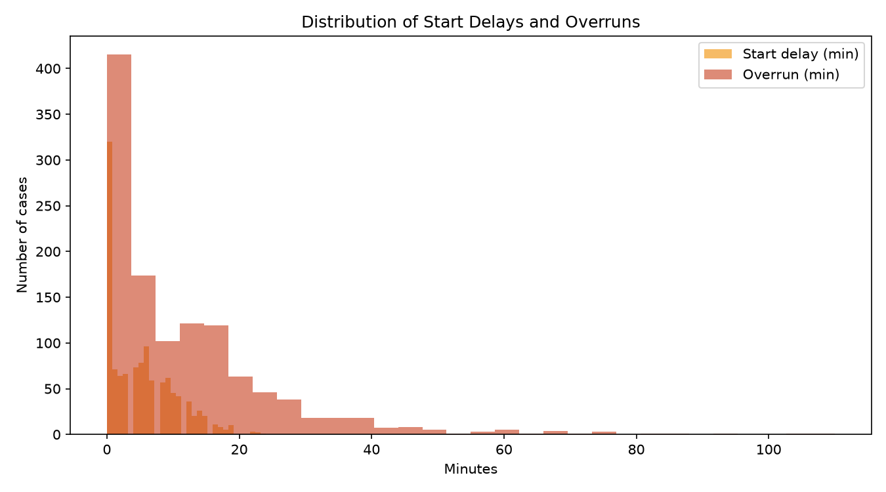
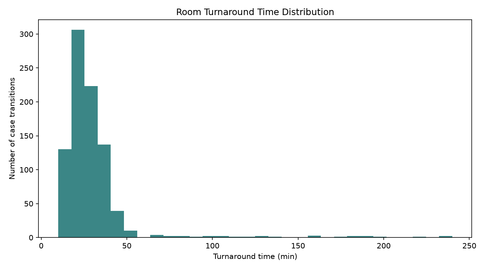

# OR / Procedure Room Utilization Report

_Generated by `or_utilization` on 2026-09-03 09:52_

## Executive Summary

- **Room-days analyzed:** 300
- **Cases scheduled:** 1249 (1175 completed, 74 cancelled)
- **Cancellation rate:** 5.9%
- **Overall room utilization:** 52.1%
- **Average start delay:** 5.2 min
- **Average overrun (when over):** 11.3 min
- **% of cases that overran scheduled time:** 72.9%
- **Average turnaround time between cases:** 29.7 min

## Utilization by Room

## Delay and Overrun Distribution

## Turnaround Time Distribution

## Surgeon-Level Summary

| surgeon_id   |   n_scheduled |   n_completed |   n_cancelled |   cancellation_rate_pct |   avg_start_delay_min |   avg_overrun_min |   avg_scheduled_duration_min |   avg_actual_duration_min |   median_case_accuracy_pct |
|:-------------|--------------:|--------------:|--------------:|------------------------:|----------------------:|------------------:|-----------------------------:|--------------------------:|---------------------------:|
| SUR-002      |           128 |           125 |             3 |                     2.3 |                   4.9 |              12.2 |                         79.2 |                      83.4 |                       97.4 |
| SUR-010      |           120 |           116 |             4 |                     3.3 |                   5.7 |              12   |                         72.1 |                      75.5 |                       92.8 |
| SUR-011      |           118 |           112 |             6 |                     5.1 |                   4.7 |              10.5 |                         73   |                      74.7 |                       93.9 |
| SUR-003      |           113 |           109 |             4 |                     3.5 |                   5.4 |              11.7 |                         76   |                      80.2 |                       94.6 |
| SUR-012      |           110 |           101 |             9 |                     8.2 |                   5   |              11.6 |                         79.2 |                      84.1 |                       97.6 |
| SUR-009      |           104 |            97 |             7 |                     6.7 |                   4.9 |              10.5 |                         77.6 |                      80.4 |                       95.9 |
| SUR-008      |           102 |            98 |             4 |                     3.9 |                   5.6 |              10.7 |                         77.8 |                      79.3 |                       94.7 |
| SUR-005      |            99 |            93 |             6 |                     6.1 |                   4.6 |              11.7 |                         74   |                      77.9 |                       93.8 |
| SUR-006      |            96 |            88 |             8 |                     8.3 |                   5.8 |              11   |                         81.7 |                      84.6 |                       94.7 |
| SUR-004      |            94 |            87 |             7 |                     7.4 |                   6   |              10.6 |                         72.3 |                      72.8 |                       96.8 |
| SUR-007      |            89 |            78 |            11 |                    12.4 |                   4.2 |               9   |                         68.7 |                      72.8 |                       96.6 |
| SUR-001      |            76 |            71 |             5 |                     6.6 |                   5.3 |              14.5 |                         85.3 |                      94.3 |                       92.9 |

## Room / Day Summary (first 15 rows)

| room_id   | date       |   block_minutes |   occupied_minutes |   idle_minutes |   utilization_pct |   n_scheduled |   n_completed |   n_cancelled |   cancellation_rate_pct |   avg_start_delay_min |   avg_overrun_min |   avg_turnaround_min |   total_overrun_min |
|:----------|:-----------|----------------:|-------------------:|---------------:|------------------:|--------------:|--------------:|--------------:|------------------------:|----------------------:|------------------:|---------------------:|--------------------:|
| OR-1      | 2025-01-06 |             600 |                255 |            345 |              42.5 |             3 |             3 |             0 |                       0 |                   0.3 |              10.3 |                 24   |                  31 |
| OR-1      | 2025-01-07 |             600 |                185 |            415 |              30.8 |             3 |             3 |             0 |                       0 |                   5.3 |              10   |                 24.5 |                  30 |
| OR-1      | 2025-01-08 |             600 |                125 |            475 |              20.8 |             4 |             2 |             2 |                      50 |                   7   |               5   |                 45   |                  10 |
| OR-1      | 2025-01-09 |             600 |                357 |            243 |              59.5 |             4 |             4 |             0 |                       0 |                   8.2 |              30.2 |                 19.3 |                 121 |
| OR-1      | 2025-01-10 |             600 |                356 |            244 |              59.3 |             4 |             4 |             0 |                       0 |                   6.8 |              14   |                 23.7 |                  56 |
| OR-1      | 2025-01-13 |             600 |                146 |            454 |              24.3 |             4 |             4 |             0 |                       0 |                   6   |               8.2 |                 25.7 |                  33 |
| OR-1      | 2025-01-14 |             600 |                402 |            198 |              67   |             4 |             4 |             0 |                       0 |                   5   |               9.8 |                 19.7 |                  39 |
| OR-1      | 2025-01-15 |             600 |                290 |            310 |              48.3 |             4 |             4 |             0 |                       0 |                   7   |               9.2 |                 23   |                  37 |
| OR-1      | 2025-01-16 |             600 |                220 |            380 |              36.7 |             3 |             3 |             0 |                       0 |                   4.3 |               6.3 |                 21.5 |                  19 |
| OR-1      | 2025-01-17 |             600 |                309 |            291 |              51.5 |             4 |             4 |             0 |                       0 |                   5   |              11.5 |                 25.7 |                  46 |
| OR-1      | 2025-01-20 |             600 |                133 |            467 |              22.2 |             3 |             3 |             0 |                       0 |                   3.7 |               0.7 |                 23.5 |                   2 |
| OR-1      | 2025-01-21 |             600 |                329 |            271 |              54.8 |             6 |             6 |             0 |                       0 |                   3.8 |               8.5 |                 20.8 |                  51 |
| OR-1      | 2025-01-22 |             600 |                415 |            185 |              69.2 |             4 |             4 |             0 |                       0 |                   4   |               4.5 |                 22.3 |                  18 |
| OR-1      | 2025-01-23 |             600 |                348 |            252 |              58   |             3 |             3 |             0 |                       0 |                   6.3 |              24   |                 21.5 |                  72 |
| OR-1      | 2025-01-24 |             600 |                214 |            386 |              35.7 |             4 |             3 |             1 |                      25 |                   6.3 |              13   |                 18   |                  39 |
